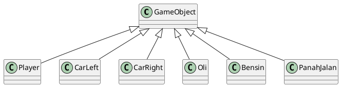
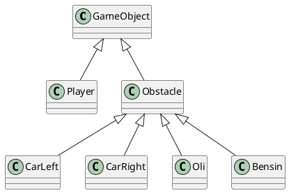
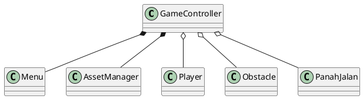

# NO BRAKE CAR

**NO BRAKE CAR** adalah game balap 2D berbasis Python & Pygame, dikembangkan sebagai Tugas Besar Pemrograman Berorientasi Objek.

---

## 🚀 Daftar Isi

* [📖 Deskripsi Proyek](#-deskripsi-proyek)
* [✨ Fitur Utama](#-fitur-utama)
* [📦 Dependensi](#-dependensi)
* [⚙️ Instalasi](#️-instalasi)
* [▶️ Cara Menjalankan](#️-cara-menjalankan)
* [🗂️ Struktur Direktori](#️-struktur-direktori)
* [🧩 UML Class Diagram](#️-uml-class-diagram)
* [🤝 Kontributor](#-kontributor)
---

## 📖 Deskripsi Proyek

NO BRAKE CAR menantang pemain untuk mengendarai mobil di jalan lebar 1200px, menghindari rintangan, dan mengumpulkan item. Proyek ini bertujuan menerapkan konsep:

* **Enkapsulasi**: atribut `speed`, `slippery`, dan `hit` disembunyikan.
* **Abstraksi**: kelas abstrak `GameObject` dengan metode `update()`.
* **Pewarisan**: `Player`, `CarLeft`, `CarRight`, `Oli`, `Bensin`, `Pohon`, `PanahJalan` mewarisi `GameObject`.
* **Polimorfisme**: `update()` di tiap subclass berbeda implementasi.

---

## ✨ Fitur Utama

1. **Menu Pemilihan Mobil**: 8 varian mobil.
2. **Slippery Effect**: mobil tergelincir saat terkena oli.
3. **Health Bar & Bensin Item**: kelola nyawa dan isi ulang.
4. **Score Counter**: naik seiring waktu.
5. **Dynamic Difficulty**: obstacle semakin cepat.
6. **Spawn Obstacle**: di dua jalur kiri/kanan.
7. **Panah Jalan**: 10 kolom marker.
8. **Game Over Screen**: opsi **R** (restart) & **M** (menu).

---

## 📦 Dependensi

* Python ≥ 3.11
* Pygame ≥ 2.6.1

Instal via pip:

```bash
pip install pygame
```

---

## ⚙️ Instalasi

1. Clone repository:

````
2. Pastikan Python & Pygame terpasang.

---
## ▶️ Cara Menjalankan

```bash
python main.py
````

1. Pilih mobil dengan **← / →**
2. Tekan **SPACE** untuk mulai
3. Hindari obstacle, kumpulkan bensin
4. Saat **GAME OVER**, tekan **R** untuk restart atau **M** untuk kembali ke menu

---

## 🗂️ Struktur Direktori

```
CarRacing/
├── Assets/
│   ├── Car/             # Sprite mobil
│   ├── Object/          # Gambar oli, bensin, pohon, panah
│   └── sound/           # Suara backsound & efek
├── img/uml/             # Diagram UML (png)
├── main.py              # Kode utama game
└── README.md
```

---

## 🧩 UML Class Diagram

**Progress 1** (basic inheritance):



**Progress 2** (Obstacle intermediate):



**Final** (GameController & AssetManager):



---

## 🤝 Kontributor

* 122140124 – Yasir Ahmad Fauzan
* 122140126 – Alfino Pardiansyah Hutahaean
